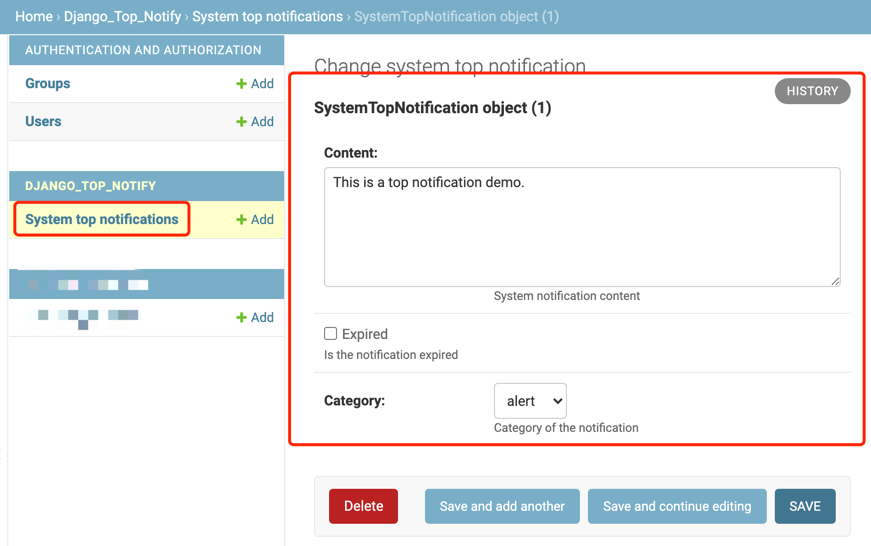

# django-top-notify
[](https://github.com/normal-wls/django-top-notify/blob/main/LICENSE) [](https://github.com/normal-wls/django-top-notify/releases)

A top notification bar based on Django project.

### Feature 
- Integrate into an existing Django project easily.
- Support `hint` and `alert` type of top notification.
- Publish and cancel top notification dynamically without deployment.
- Latest notification will automatically be displayed.

### Demo
- Publish or cancel

  Use Django Admin page to configure:

  

- Hint top notification

  

- Alert top notification

  

### Quick Start
- Install django-top-notify:
  ```shell
  # bash
  pip install django-top-notify
  ```
- Add `django_top_notify` into INSTALLED_APPS:
  ``` python
  # settings.py
  INSTALLED_APPS = [
      ...
      "django_top_notify",
      ...
  ]
  ```
- Add urls into urlpatterns:
  ``` python
  # urls.py
  urlpatterns = [
    ...
    path("top_notify/", include("django_top_notify.urls")),
    ...
  ]
  ```
- Collect static files & migrate:
  ```shell
  # bash
  python manage.py collectstatic
  python manage.py migrate django_top_notify
  ```
- Add frontend elements into template:
  ``` html
  <!--templates/index.html-->
  
  <head>
      <link rel="stylesheet" href="">
  </head>
  <body>
      <div class="notification-top-bar-container"><div class="notification-top-bar"><p></p></div></div>
      ...
      <script src="https://cdnjs.cloudflare.com/ajax/libs/jquery/1.10.2/jquery.min.js"></script>
      <script src=""></script>
      <script>
          $(function () {
              const url = "";
              get_latest_system_notification(url);
          })
      </script>
  </body>
  ```

### Donations
If this project helps you, please reward the author with a cup of coffee.（＾∀＾）

